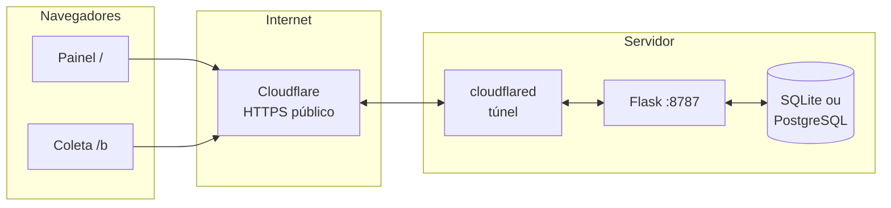

<div align="center">

# Cyber Awareness Lab

### Nome do projeto · **Cyber Awareness Lab**

**Descrição (elevator pitch):** aplicação **Flask** com **painel único** (`/` e `/ver`) para ver **coletas** (foto, GPS, dispositivos agrupados, auditoria) e link **`/b`** para o telemóvel enviar dados. Persistência em **SQLite** ou **PostgreSQL**.

[](./LICENSE)
[](./README.md)

[](https://www.python.org/)
[](https://flask.palletsprojects.com/)
[](https://www.postgresql.org/)
[](https://www.sqlite.org/)
[](./LICENSE)
[](#contribuir)

[Instalação](#readme-install) · [Mapa do repositório](#readme-mapa) · [API](#readme-api) · [Cloudflare e HTTPS](#readme-cloudflare) · [Base de dados](#readme-db) · [Ética](#readme-etica)

*English one-liner:* **Flask dashboard** for grouped device captures (photo, GPS, JSON) plus a minimal **`/b`** capture page; SQLite or PostgreSQL storage.

</div>

---

## Índice

1. [O que este projeto faz](#readme-visao)
2. [Arquitetura (visão geral)](#readme-arch)
3. [Mapa completo do repositório](#readme-mapa)
4. [Rotas web (páginas)](#readme-rotas)
5. [Referência de API](#readme-api)
6. [Front-end (ficheiros estáticos)](#readme-front)
7. [Base de dados](#readme-db)
8. [Cloudflare, HTTPS, DNS e por que o celular precisa de HTTPS](#readme-cloudflare)
9. [Produção (Gunicorn)](#readme-gunicorn)
10. [Instalação rápida](#readme-install)
11. [Publicar no GitHub e LinkedIn](#readme-github)
12. [Ética e uso responsável](#readme-etica)
13. [Contribuir](#contribuir)

---

<a id="readme-visao"></a>

## O que este projeto faz

| Uso | Rota | O que acontece |
|-----|------|----------------|
| Painel (única interface) | `/` ou `/ver` | **Mesma página:** coletas agrupadas por dispositivo, foto, GPS, JSON, renomear dispositivo, auditoria. |
| Envio a partir do telemóvel | `/b` | Ecrã escuro; pede **câmera** e **GPS**; envia pacote ao servidor e redireciona. Opcional: `/b?nome=Nome+Sobrenome`. |

Os dados são gravados em **SQLite** ou **PostgreSQL**, incluindo **auditoria** dos pedidos à API.

---

<a id="readme-arch"></a>

## Arquitetura (visão geral)



- **Flask** serve HTML, CSS, JS e JSON.
- **Túnel Cloudflare** (opcional) expõe o Flask com **HTTPS** e um **hostname** acessível na Internet, sem abrir portas no router (ideal para demo com telemóveis na mesma aula).

---

<a id="readme-mapa"></a>

## Mapa completo do repositório

Cada ficheiro/pasta e o seu papel.

| Caminho | Função |
|---------|--------|
| **`app.py`** | Aplicação Flask: rotas HTML, cabeçalhos de segurança (CSP, `Permissions-Policy`, etc.), orquestração de relatórios e chamadas à camada de dados. |
| **`storage.py`** | Camada de persistência: deteta **PostgreSQL** (`DATABASE_URL` ou `POSTGRES_*`) ou cai para **SQLite** em `instance/`; cria tabelas; insere coletas, nomes e auditoria. Carrega **`.env`** via `python-dotenv` se instalado. |
| **`wsgi.py`** | Ponto de entrada para **Gunicorn**: `gunicorn wsgi:app`. |
| **`requirements.txt`** | Dependências: Flask, Gunicorn, `psycopg`, `python-dotenv`. |
| **`templates/beacon.html`** | Shell mínimo da rota `/b` (ecrã escuro + vídeo invisível para captura). |
| **`templates/ver.html`** | Shell do painel em `/` e `/ver`: toolbar de atualização, coletas e auditoria. |
| **`static/beacon.js`** | Lógica de `/b`: `getUserMedia`, geolocalização, `client_bundle`, POST `/api/lab-report`. |
| **`static/ver.js`** | Lógica do painel: polling, agrupamento por `device_key`, renomear dispositivo, pausa de refresh ao editar/ler JSON. |
| **`static/styles.css`** | Estilos do painel e da rota `/b` (onde aplicável). |
| **`scripts/cloudflare-quick-tunnel.sh`** | Arranca **`cloudflared`** em modo **Quick Tunnel** (URL `*.trycloudflare.com`). |
| **`.env.example`** | Modelo de variáveis (sem segredos). Copiar para `.env`. |
| **`.gitignore`** | Evita commit de `.venv`, `.env`, `instance/*.sqlite`, caches. |
| **`INSTRUCOES.txt`** | Notas operacionais em português (túnel, rotas, base de dados). |
| **`LICENSE`** | Licença **MIT** (open source permissiva). |
| **`README.md`** | Este documento. |

---

<a id="readme-rotas"></a>

## Rotas web (páginas)

| Rota | Ficheiro | Descrição |
|------|----------|-----------|
| `GET /` e `GET /ver` | `templates/ver.html` + `static/ver.js` | Painel: coletas, fotos, geo, JSON, nomes, auditoria. |
| `GET /b` | `templates/beacon.html` + `static/beacon.js` | Ecrã escuro; captura e envio para o painel. |

---

<a id="readme-api"></a>

## Referência de API

Todas definidas em **`app.py`**.

| Método | Caminho | Descrição |
|--------|---------|-----------|
| `GET` | `/api/server-meta` | Devolve JSON com o que o **servidor** infere do pedido HTTP (IP, `User-Agent`, headers típicos). Grava evento em **auditoria** (BD). |
| `POST` | `/api/lab-report` | Corpo JSON com `client_bundle`. Se `beacon_capture` for verdadeiro, persiste **coleta `/b`**. Grava **auditoria**. |
| `GET` | `/api/beacon-tail` | Últimas coletas + mapa `labels` (nomes por `device_key`). Usado pelo `/ver`. |
| `POST` | `/api/device-label` | Corpo: `device_key`, `label` — define ou limpa nome amigável no painel. |
| `GET` | `/api/audit-tail` | Últimos eventos de auditoria (persistidos em BD). |

---

<a id="readme-front"></a>

## Front-end (ficheiros estáticos)

| Ficheiro | Responsabilidade |
|----------|------------------|
| **`beacon.js`** | Parâmetros URL (`nome`, etc.), câmera, GPS, diagnóstico, POST `lab-report`, redirecionamento. |
| **`ver.js`** | Agrupamento por dispositivo, chips (foto/GPS/HTTPS), detalhes colapsáveis, guardar nome, pausa de atualização ao editar/ler JSON. |
| **`styles.css`** | Tema escuro, tipografia, layout do painel. |

---

<a id="readme-db"></a>

## Base de dados

### Modos

- **SQLite** (padrão se não houver URL Postgres): ficheiro `instance/lab.sqlite`. Bom para laptop e demos rápidas. Limite por omissão de **~200** coletas beacon (configurável).
- **PostgreSQL**: defina `DATABASE_URL` ou `POSTGRES_HOST` + utilizador + password + base. Recomendado para **servidor fixo**, backups e volume maior. Limite de coletas por omissão **ilimitado** (use `LAB_BEACON_MAX` se quiser poda).

### Tabelas (criadas automaticamente)

| Tabela | Conteúdo |
|--------|----------|
| `beacon_events` | Cada envio `/b`: timestamps, IP, UA, contexto, geo, câmera, fingerprint, **foto base64**, cópia estruturada do pacote (`raw_bundle_json`). |
| `device_labels` | Nome amigável por `device_key` (painel ou `/b?nome=`). |
| `audit_events` | Linha do tempo de `server-meta` e `lab-report` (metadados e pré-visualização do bundle). |

### Variáveis de ambiente (resumo)

| Variável | Função |
|----------|--------|
| `DATABASE_URL` | URL `postgresql://…` (ou `postgres://`, normalizado). |
| `POSTGRES_*` / `PG*` | Construção alternativa da URL se `DATABASE_URL` estiver vazio. |
| `LAB_BEACON_MAX` | Máximo de linhas em `beacon_events` (`0` = sem limite). |
| `LAB_AUDIT_MAX` | Máximo de linhas em `audit_events` (padrão 5000; `0` = sem limite). |

Detalhe completo: **`.env.example`**.

---

<a id="readme-cloudflare"></a>

## Cloudflare, HTTPS, DNS e por que o celular precisa de HTTPS

### O problema: contexto seguro no browser

APIs sensíveis (**`navigator.geolocation`**, **`getUserMedia`** / câmera) só funcionam de forma fidedigna em **contexto seguro**:

- **`https://`** (TLS ativo), ou  
- **`http://localhost`** / `http://127.0.0.1` em alguns casos.

Numa rede Wi‑Fi típica, o telemóvel acede ao teu laptop por **`http://192.168.x.x:8787`**. Isso **não** é considerado “secure context” para essas APIs: o browser **bloqueia** ou limita GPS e câmera. Por isso, em aulas com telemóveis reais, quase sempre precisas de **HTTPS com um nome público** — daí o túnel.

### O que é HTTPS aqui?

- **HTTPS** = HTTP sobre **TLS**: tráfego **cifrado** entre o browser e o primeiro nó (ex.: Cloudflare).  
- O browser mostra o **cadeado** e valida o **certificado** contra o **nome do host** (DNS), por exemplo `something.trycloudflare.com` ou `lab.empresa.com`.

**HTTPS não esconde os dados do teu servidor**: o teu Flask continua a receber o pacote em claro *dentro* do processo — o lab ensina precisamente isso.

### DNS (Domain Name System)

- **DNS** traduz um **nome** (`aula.exemplo.com`) num **endereço IP**.  
- Para um domínio teu apontar para um túnel Cloudflare **nomeado**, crias um registo (frequentemente **CNAME**) na zona DNS desse domínio, conforme a documentação Cloudflare.  
- O **Quick Tunnel** (`trycloudflare.com`) **já traz** um hostname aleatório gerido pela Cloudflare — **não precisas** de comprar domínio para uma demo de uma hora.

### Modo 1: Quick Tunnel (este repositório)

O script **`scripts/cloudflare-quick-tunnel.sh`** corre o **`cloudflared`** em modo rápido:

1. Instalas o `cloudflared` na máquina onde corre o Flask.  
2. Com o Flask a escutar (ex. porta **8787**), o túnel cria uma URL pública **`https://….trycloudflare.com`**.  
3. Essa URL **termina TLS na Cloudflare** e encaminha para o teu `localhost:8787`.

**Características úteis para o README / LinkedIn:**

| Aspeto | Quick Tunnel |
|--------|----------------|
| Custo | Grátis para testes rápidos (sujeito a políticas Cloudflare). |
| DNS teu | Não precisas; o hostname é gerado. |
| URL | **Muda** quando reinicias o processo (nova sessão). |
| Uptime | Enquanto o **`cloudflared`** estiver a correr. |

### Modo 2: Named Tunnel + o teu DNS (produção / institucional)

Para **`https://lab.tuaempresa.com`** estável:

1. Conta **Cloudflare Zero Trust** / **Cloudflare One**.  
2. Criar um **Cloudflare Tunnel** nomeado e instalar credencial no servidor.  
3. Configurar o **hostname público** no dashboard e um registo **DNS** (CNAME) que aponta para o túnel.  
4. Manter **`cloudflared`** como serviço (systemd, Docker, etc.).

Isto aproxima-se do que empresas fazem para expor aplicações internas **sem** abrir portas de entrada no firewall — bom tópico para post no LinkedIn.

Documentação oficial (túneis e Zero Trust): [developers.cloudflare.com/cloudflare-one/connections/connect-apps](https://developers.cloudflare.com/cloudflare-one/connections/connect-apps/).

### Resumo visual

```
Telemóvel  --HTTPS-->  Cloudflare (certificado válido, nome público)
                          |
                          v
                   cloudflared (no teu PC/servidor)
                          |
                          v
                   Flask :8787  -->  SQLite / PostgreSQL
```

---

<a id="readme-gunicorn"></a>

## Produção (Gunicorn)

```bash
cd cyber-awareness-lab
source .venv/bin/activate
gunicorn -w 2 -b 0.0.0.0:8787 wsgi:app
```

Coloca um **reverse proxy** (Nginx, Caddy, Traefik) à frente se precisares de TLS local sem Cloudflare, ou mantém **somente** Cloudflare como borda TLS.

---

<a id="readme-install"></a>

## Instalação rápida

```bash
git clone https://github.com/SEU_USUARIO/cyber-awareness-lab.git
cd cyber-awareness-lab
python3 -m venv .venv
source .venv/bin/activate   # Windows: .venv\Scripts\activate
pip install -r requirements.txt
cp .env.example .env        # opcional: PostgreSQL
python app.py               # http://0.0.0.0:8787
```

Noutro terminal (demo com telemóveis):

```bash
bash scripts/cloudflare-quick-tunnel.sh
# Use o https://….trycloudflare.com/b e / (ou /ver) conforme INSTRUCOES.txt
```

---

<a id="readme-github"></a>

## Publicar no GitHub e dica para o LinkedIn

1. Cria um repositório **público** no GitHub.  
2. Faz push desta pasta como raiz do repo.  
3. Em **Settings → General → Social preview**, carrega uma imagem **1280×640** (logo + título “Cyber Awareness Lab”) — melhora muito a pré-visualização quando partilhas no **LinkedIn**.  
4. No post, destaca: **painel de coletas**, **HTTPS / Cloudflare**, **Flask + Postgres**, **open source MIT**.

Sugestão de **topics** no GitHub: `flask`, `cybersecurity`, `privacy`, `education`, `postgresql`, `sqlite`, `cloudflare-tunnel`, `awareness`, `python`.

---

<a id="readme-etica"></a>

## Ética e uso responsável

Este software existe para **ensino** e **testes autorizados**. Quem o implementa é responsável por cumprir a **lei aplicável** (proteção de dados, políticas internas, etc.), ser **transparente** sobre o que é recolhido e **não** usar o sistema contra terceiros sem autorização.

Na rota **`/b`**, o navegador mostra sempre os **pedidos nativos** de permissão de câmera e localização.

---

<a id="contribuir"></a>

## Contribuir

Issues e pull requests são bem-vindos: melhorias de acessibilidade, i18n, testes automatizados, hardening de cabeçalhos, ou documentação.

1. Fork → branch → PR.  
2. Mantém o foco educativo e a transparência sobre o que o código faz.

---

<div align="center">

**Cyber Awareness Lab** · *Consciencialização responsável · Flask · HTTPS · Open source*

[⬆ Voltar ao topo](#cyber-awareness-lab)

</div>
